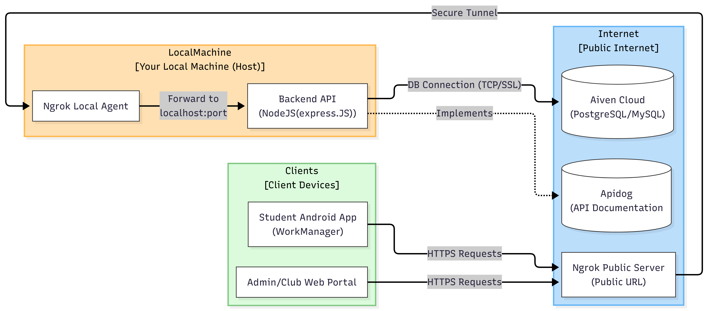
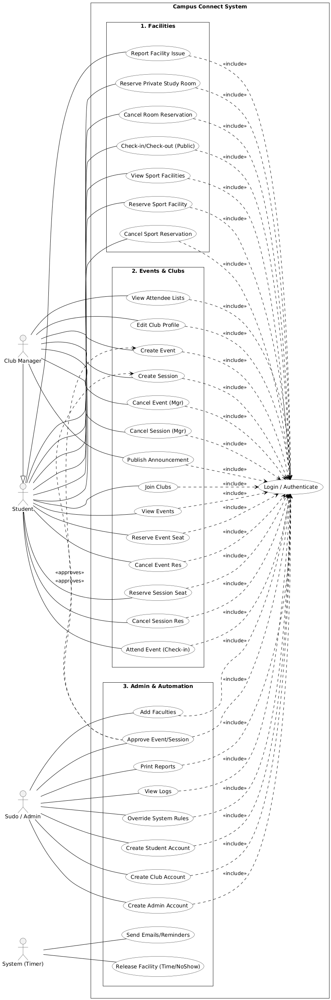

# Software Requirements Specification

## for CampusConnect

**Version:** 1.0 approved
**Prepared by:**

-   **Mostafa Mohamed Essa** (ID: 320230181)
-   **Amr Mahmoud** (ID: 320230204)
-   **Abdallah Kassem** (ID: 320230213)
-   **Ahmed Samy** (ID: 320230170)
-   **Mazen Hatem** (ID: 320230207)
-   **Ahmed Abdelrahman** (ID: 320230152)

**Organization:** CampusConnect Dev Team

---

## Table of Contents

1. [Introduction](#1-introduction)
2. [Overall Description](#2-overall-description)
3. [System Features](#3-system-features)
4. [External Interface Requirements](#4-external-interface-requirements)
5. [Other Nonfunctional Requirements](#5-other-nonfunctional-requirements)
6. [Appendix A: Glossary](#appendix-a-glossary)

---

## 1. Introduction

### 1.1 Purpose

The purpose of this document is to define the software requirements for **CampusConnect Version 1.0**. This application acts as a unified digital ecosystem designed to streamline interactions between students, student clubs, and university administration. It covers the Android mobile application for students and club managers, as well as the Web Dashboard for university administrators.

### 1.2 Document Conventions

-   **Bold text** is used to highlight key database entities or user roles.
-   **Monospace font** is used for database columns, API endpoints, or code variables (e.g., `is_active`).
-   Priorities are defined as High, Medium, or Low. High-priority items are critical for the Minimum Viable Product (MVP).

### 1.3 Intended Audience and Reading Suggestions

-   **Developers:** Focus on Section 3 (System Features) and Section 4 (External Interfaces) for API and Database implementation details.
-   **Project Managers/Testers:** Focus on Section 2 (Overall Description) to understand the user flow and constraints.

### 1.4 Project Scope

**CampusConnect** is a SaaS (Software as a Service) platform customizable for higher education institutions.

-   **Objective:** To replace fragmented campus communication (emails, notice boards, separate booking systems) with a single app.
-   **Core Functionality:**
    1. Centralized Event Discovery & Attendance Tracking.
    2. Resource Reservation (Study rooms, Gyms, Playgrounds).
    3. Student Club Management & Social Feeds.
    4. Administrative Analytics & User Management.

---

## 2. Overall Description

### 2.1 Product Perspective

This product is a self-contained solution consisting of:

1. **Mobile Client (Android/Kotlin):** The primary interface for Students and Club Managers.
2. **Web Admin Panel (React/Web):** The management interface for University Admins.
3. **Backend API (Node.js/Express):** The central logic processing requests.
4. **Database (MariaDB):** The storage engine using InnoDB for transaction integrity.

#### 2.1.1 System Architecture


_Figure 2.1: CampusConnect System Deployment Architecture_

### 2.2 Product Features

-   **Unified Login:** Single sign-on for all user types.
-   **Role Switching:** Club managers can toggle between "Student View" and "Manager View" within the same app.
-   **Smart Search:** Pattern-matching search for finding students and events.
-   **Reservation System:** Real-time booking for rooms and facilities with conflict detection.
-   **Attendance Scanner:** In-app QR/Barcode scanning for instructors to verify student attendance.
-   **Offline Mode:** Caching of schedules and downloaded content for offline access.

### 2.3 User Classes and Characteristics

| User Class        | Description                                               | Key Privileges                                                                    |
| :---------------- | :-------------------------------------------------------- | :-------------------------------------------------------------------------------- |
| **Student**       | Regular university student.                               | View events, reserve rooms, join clubs, view profile.                             |
| **Club Manager**  | A Student with elevated permissions for a specific club.  | Create posts, organize events, manage club members. Toggleable view.              |
| **Administrator** | University staff (Super Admin, Sport Admin, Event Admin). | Manage users, approve/reject clubs, view analytics, manage facility availability. |

### 2.4 Operating Environment

-   **Client OS:** Android 10.0+ (API Level 29+).
-   **Web Dashboard:** Modern Browsers (Chrome, Firefox, Edge).
-   **Server:** Node.js v20+ environment (Linux/EndeavourOS).
-   **Database:** MariaDB 10.6+.

### 2.5 Design and Implementation Constraints

-   **Language:** The user interface shall be in **English** only.
-   **Connectivity:** The application must support **Offline Mode** for viewing previously fetched data (e.g., event tickets, user ID). Critical actions (Reservations) require an active connection.
-   **Database Constraints:** Must use Foreign Keys to ensure referential integrity; "Soft Delete" must be used for posts and essential records to preserve audit trails.

### 2.6 Assumptions and Dependencies

-   It is assumed the university has a reliable Wi-Fi network for the "Attendance Scanning" feature to sync in real-time.
-   The system depends on the `ngrok` tunneling service for development/testing phases to expose the local backend to mobile devices.

### 2.7 Use Case Overview


_Figure 2.2: CampusConnect Use Case Diagram_

---

## 3. System Features

### 3.1 Authentication & Role Management

**3.1.1 Description:**
Secure entry point using Stateless Authentication (JWT). The system determines the user type (Student vs. Admin) via a lookup table before validating credentials.
**Priority:** High

**3.1.2 Functional Requirements:**

-   **REQ-AUTH-1:** The system shall validate email/password against the `user_type` lookup table first.
-   **REQ-AUTH-2:** If the user is a Student, the system shall check the `students` table; if Admin, the `admins` table.
-   **REQ-AUTH-3:** Upon successful login, the system shall issue a JWT containing `user_id`, `role`, and `is_active` status.

**3.1.3 Activity Flow:**

_Figure 3.1: Authentication Process Activity Diagram_


_Figure 3.2: Extended System Activity Diagram_

### 3.2 Resource & Facility Reservation

**3.2.1 Description:**
Allows students to book study rooms, gym slots, playgrounds, or seats in seminars.
**Priority:** High

**3.2.2 Functional Requirements:**

-   **REQ-RES-1:** The system shall display available time slots for facilities (Study Rooms, Gym, Playgrounds).
-   **REQ-RES-2:** The system must prevent double-booking (ACID transaction compliance).
-   **REQ-RES-3:** Students shall receive immediate confirmation or rejection of the reservation.

**3.2.3 Process Flow:**

_Figure 3.3: Student Room Reservation Sequence Diagram_


_Figure 3.4: Study Room Reservation State Machine_

### 3.3 Club Hub & Social Feed

**3.3.1 Description:**
A social platform where clubs post updates and students engage.
**Priority:** Medium

**3.3.2 Functional Requirements:**

-   **REQ-CLUB-1:** Club Managers shall be able to create posts with text and images.
-   **REQ-CLUB-2:** Students shall be able to view a feed of posts from clubs they follow.
-   **REQ-CLUB-3:** The system shall implement "Soft Delete" (`is_deleted = true`) for posts to allow admin auditing of removed content.

**3.3.3 Club Management Flow:**

_Figure 3.5: Club Manager Events Session Sequence Diagram_


_Figure 3.6: Club Management State Machine_


_Figure 3.7: Student Club Membership State Machine_

### 3.4 Attendance Tracking

**3.4.1 Description:**
A mechanism for validating physical presence at events using the mobile device.
**Priority:** Medium

**3.4.2 Functional Requirements:**

-   **REQ-ATT-1:** The mobile app shall generate a unique Digital ID (QR/Barcode) for every student.
-   **REQ-ATT-2:** The Instructor/Organizer version of the app shall utilize the device camera to scan Student IDs.
-   **REQ-ATT-3:** The system shall record the timestamp and event ID in the `std_attend_event` table upon successful scan.

**3.4.3 Event Lifecycle:**

_Figure 3.8: Event Lifecycle State Machine_

---

## 4. External Interface Requirements

### 4.1 User Interfaces

-   **Mobile App:** Adheres to Material Design 3 guidelines.
    -   _Bottom Navigation:_ Home, Explore, My Reservations, Profile.
    -   _Floating Action Button (FAB):_ For Club Managers to create posts quickly.
-   **Web Dashboard:** Responsive layout with a sidebar navigation for Admins (Users, Events, Analytics, Settings).

### 4.2 Hardware Interfaces

-   **Camera:** The application requires access to the mobile device's rear camera for the purpose of scanning Student IDs during attendance taking. No external biometric hardware is required.

### 4.3 Software Interfaces

-   **MariaDB Database:** The backend interacts via the `mariadb` Node.js driver.
-   **REST API:** The client communicates via standard HTTP methods (GET, POST, PUT, DELETE) sending JSON data.

#### 4.3.1 System Architecture Class Diagram


_Figure 4.1b: CampusConnect Backend Class Diagram - Services and Repositories_

#### 4.3.2 Package Structure Diagrams

_Figure 4.1: CampusConnect Backend Class Diagram_

#### 4.3.2 Package Structure Diagrams

##### Backend Package Structure

```text
CampusConnect-backend/
├── src/
│   ├── server.js                    # Application entry point
│   ├── config/
│   │   └── db.js                    # Database configuration
│   ├── controllers/
│   │   ├── admin.controller.js      # Admin request handlers
│   │   ├── auth.controller.js       # Authentication handlers
│   │   ├── club.controller.js       # Club management handlers
│   │   ├── event.controller.js      # Event management handlers
│   │   ├── facility.controller.js   # Facility management handlers
│   │   ├── post.controller.js       # Post management handlers
│   │   ├── room.controller.js       # Room booking handlers
│   │   └── user.controller.js       # User management handlers
│   ├── middlewares/
│   │   └── auth.middleware.js       # JWT authentication middleware
│   ├── repositories/
│   │   ├── auth.repository.js       # Authentication data access
│   │   ├── club.repository.js       # Club data access
│   │   ├── event.repository.js      # Event data access
│   │   ├── facility.repository.js   # Facility data access
│   │   ├── post.repository.js       # Post data access
│   │   ├── room.repository.js       # Room data access
│   │   └── user.repository.js       # User data access
│   ├── routes/
│   │   ├── admin.route.js           # Admin API routes
│   │   ├── auth.route.js            # Authentication routes
│   │   ├── club.route.js            # Club API routes
│   │   ├── event.route.js           # Event API routes
│   │   ├── facility.route.js        # Facility API routes
│   │   ├── post.route.js            # Post API routes
│   │   ├── room.route.js            # Room API routes
│   │   └── user.route.js            # User API routes
│   ├── services/
│   │   ├── admin.service.js         # Admin business logic
│   │   ├── auth.service.js          # Authentication business logic
│   │   ├── club.service.js          # Club business logic
│   │   ├── event.service.js         # Event business logic
│   │   ├── facility.service.js      # Facility business logic
│   │   ├── post.service.js          # Post business logic
│   │   ├── room.service.js          # Room business logic
│   │   └── user.service.js          # User business logic
│   └── utils/
│       ├── log.js                   # Logging utilities
│       └── logs.js                  # Log management
```

_Figure 4.2: Backend Package Structure_

##### Frontend Package Structure

```text
CampusConnect Frontend/
├── src/
│   ├── pages/                     # Application routes/pages
│   │   ├── Dashboard.tsx          # Main dashboard page
│   │   ├── Login.tsx             # Authentication page
│   │   ├── Students.tsx          # Student management
│   │   ├── Events.tsx            # Campus events
│   │   ├── Clubs.tsx             # Student clubs
│   │   ├── Facilities.tsx        # Facility booking
│   │   └── Reports.tsx           # Analytics & reports
│   ├── components/               # Reusable components
│   │   ├── layout/              # Application layout
│   │   │   ├── AdminLayout.tsx   # Main layout wrapper
│   │   │   ├── AdminSidebar.tsx  # Navigation sidebar
│   │   │   └── TopBar.tsx        # Header component
│   │   └── ui/                  # Base UI components (shadcn/ui)
│   │       ├── button.tsx        # Button component
│   │       ├── card.tsx          # Card container
│   │       ├── table.tsx         # Data table
│   │       └── form.tsx          # Form components
│   ├── contexts/                # Global state management
│   │   └── AuthContext.tsx      # Authentication state
│   ├── hooks/                   # Custom React hooks
│   └── lib/                     # Utility libraries
```

_Figure 4.3: Frontend Package Structure_

##### Android Package Structure

```text
com.taqsiim.compusconnect
├── CampusConnectApp.kt
├── MainActivity.kt
├── core/
│   ├── data/
│   ├── local/
│   ├── network/
│   └── util/
├── data/
│   ├── api/
│   ├── local/
│   ├── mapper/
│   ├── model/
│   └── repository/
├── features/
│   └── auth/
├── ui/
│   ├── MainViewModel.kt
│   ├── clubManager/
│   ├── components/
│   ├── navigation/
│   ├── student/
│   └── theme/
└── viewmodel/
    ├── ManagerViewModel.kt
    ├── StudentViewModel.kt
    └── ViewModelFactory.kt
```

_Figure 4.4: Android Package Structure_

---

## 5. Other Nonfunctional Requirements

### 5.1 Performance Requirements

-   The system shall support up to **1,000 concurrent users** with a response time of under **200ms** for read operations (e.g., fetching the event feed).
-   Login authentication shall complete in under **1 second**.

### 5.2 Safety Requirements

-   **Data Integrity:** Reservations must rely on database transactions to prevent "half-complete" bookings in case of connection loss.
-   **Audit Trail:** Deleted posts and banned users must remain in the database (marked inactive) for at least 12 months for administrative review.

### 5.3 Security Requirements

-   **Encryption:** All passwords must be hashed using `bcrypt` before storage.
-   **Transmission:** All data in transit must be encrypted via SSL/TLS (HTTPS).
-   **Access Control:** API endpoints must be protected by Middleware that verifies the JWT and checks specific Roles (e.g., only `event_admin` can delete an event).

---

## Appendix A: Glossary

-   **JWT:** JSON Web Token, used for secure transmission of information.
-   **SaaS:** Software as a Service.
-   **Soft Delete:** Marking a database record as "deleted" (via a flag) without actually removing the data row.
-   **ACID:** Atomicity, Consistency, Isolation, Durability (Database properties that ensure reliable transactions).
