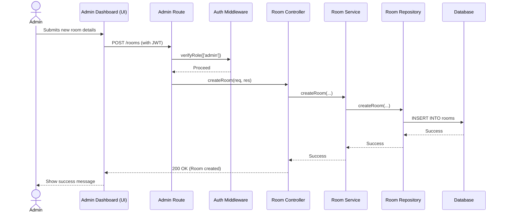
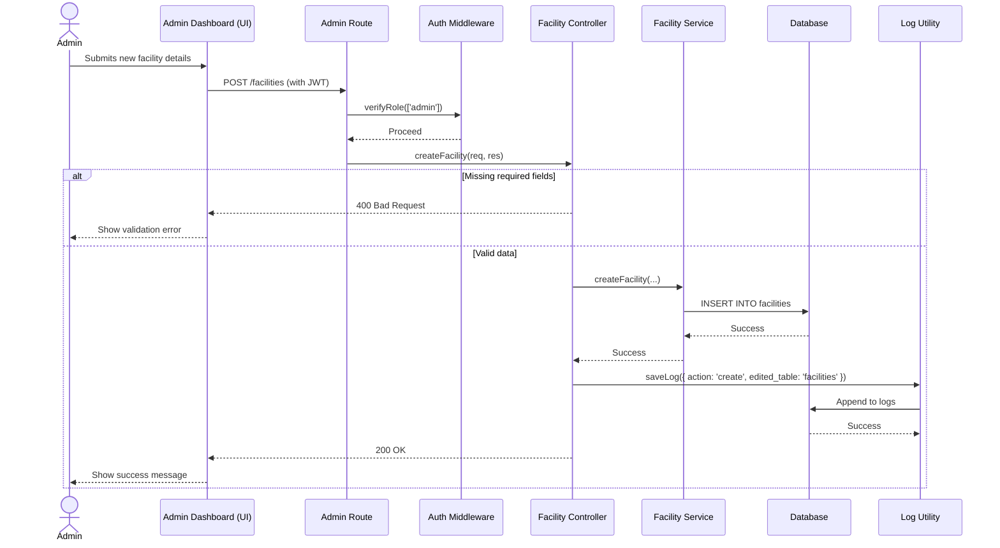
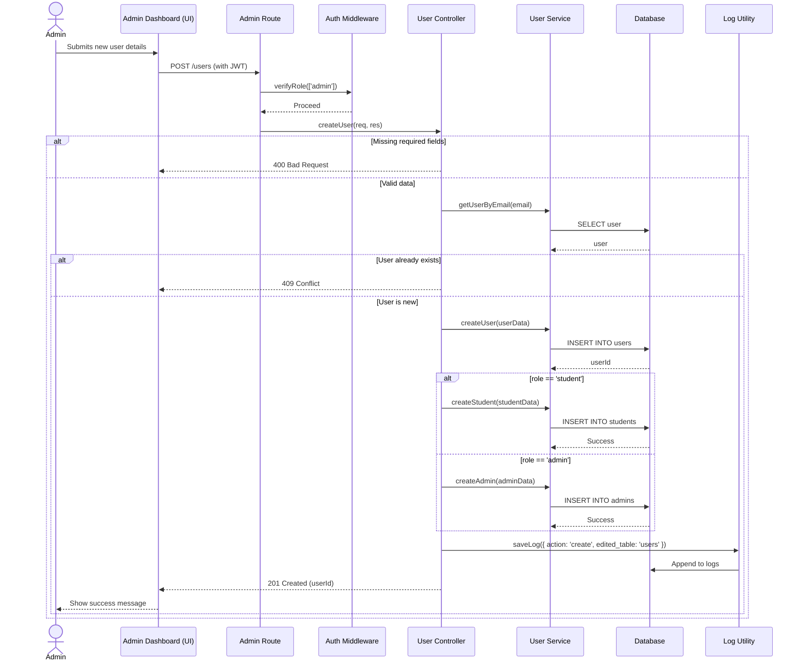
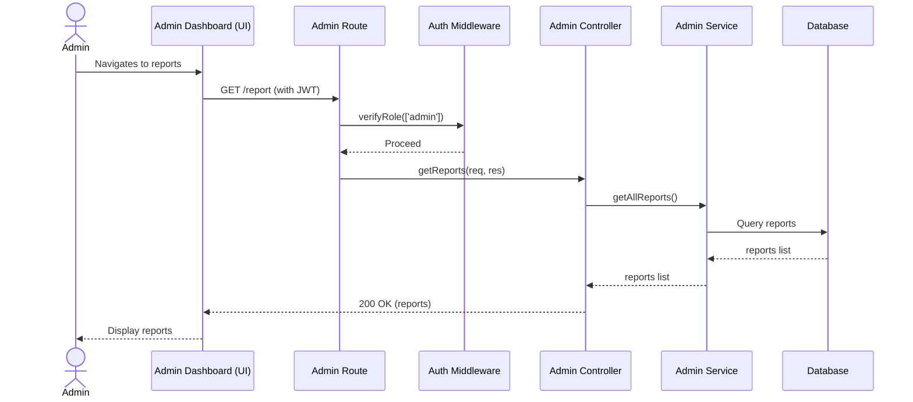
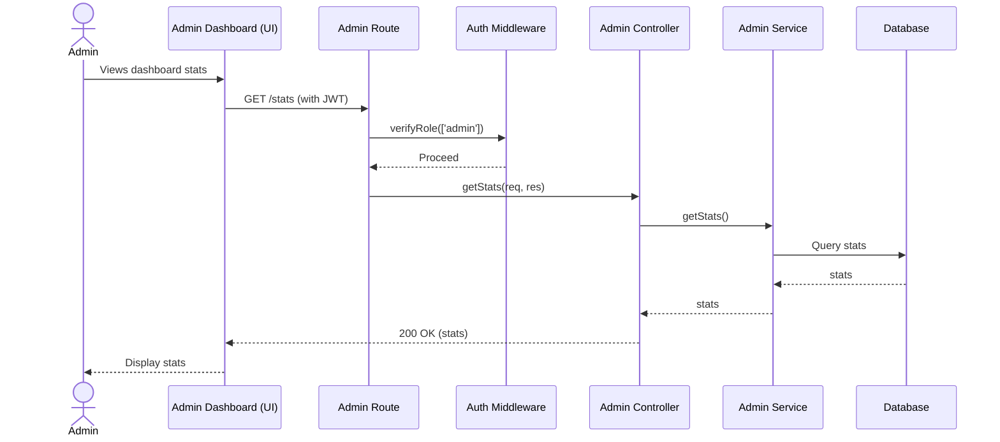
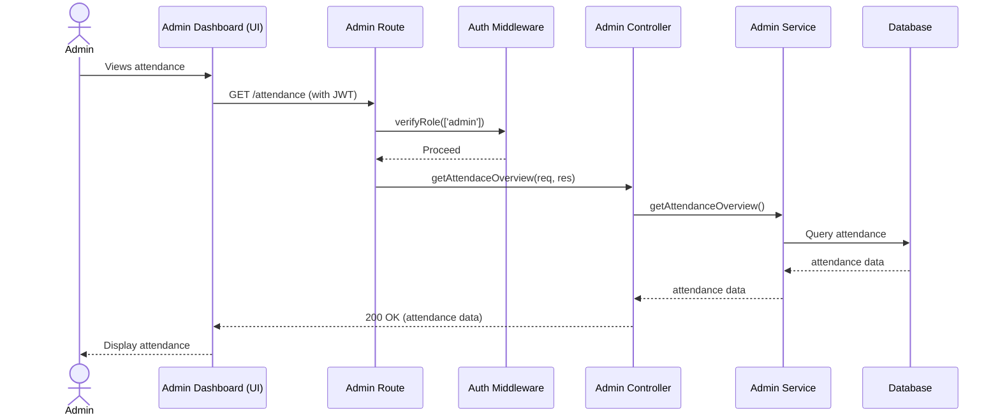
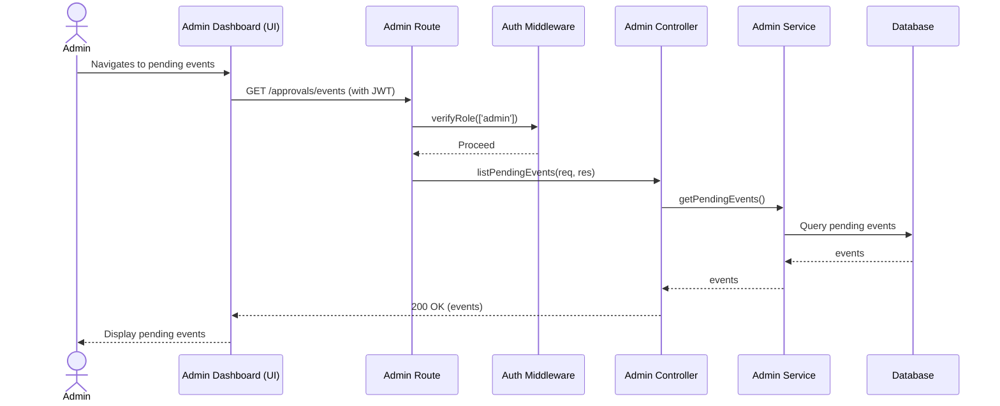
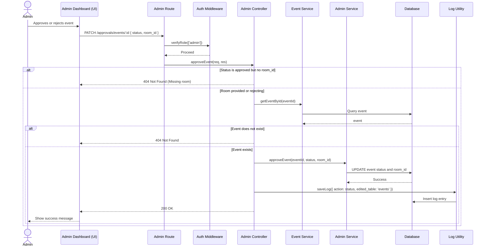
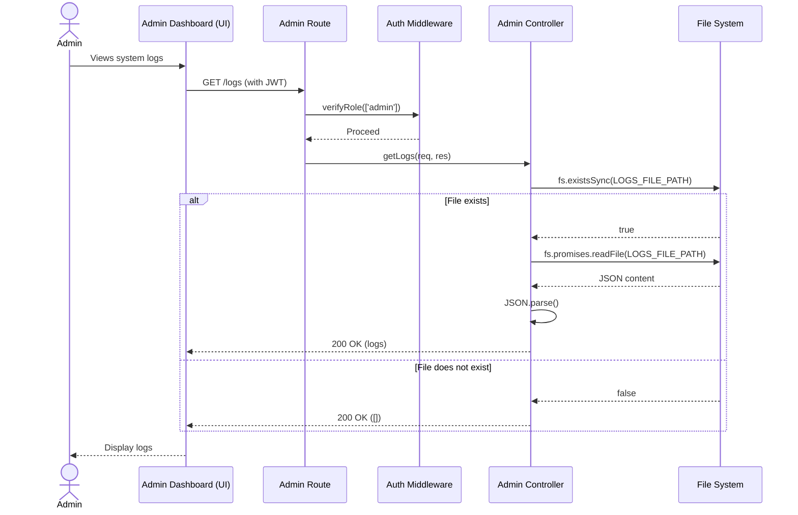

# Admin Route Sequence Diagrams

All routes in this module are protected by the `verifyRole(['admin'])` middleware.

## POST /rooms

## POST /facilities

## POST /users

## GET /report

## GET /stats

## GET /attendance

## GET /approvals/events

## PATCH /approvals/events/:id

## GET /logs

