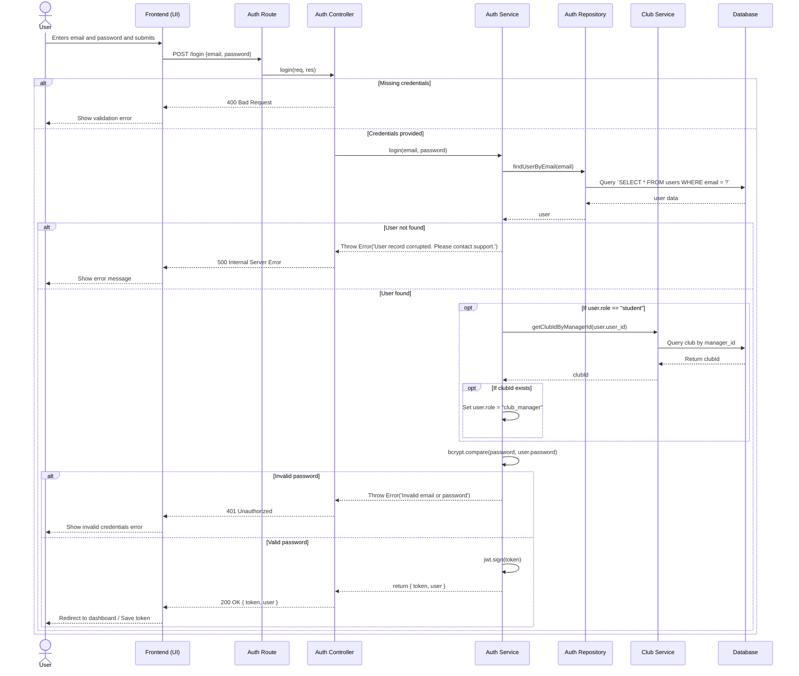

# Auth Route Sequence Diagram

## POST /login

```mermaid
sequenceDiagram
    actor User
    participant UI as Frontend (UI)
    participant Route as Auth Route
    participant Ctrl as Auth Controller
    participant Svc as Auth Service
    participant Repo as Auth Repository
    participant ClubSvc as Club Service
    participant DB as Database

    User->>UI: Enters email and password and submits
    UI->>Route: POST /login {email, password}
    Route->>Ctrl: login(req, res)
    
    alt Missing credentials
        Ctrl-->>UI: 400 Bad Request
        UI-->>User: Show validation error
    else Credentials provided
        Ctrl->>Svc: login(email, password)
        Svc->>Repo: findUserByEmail(email)
        Repo->>DB: Query `SELECT * FROM users WHERE email = ?`
        DB-->>Repo: user data
        Repo-->>Svc: user
        
        alt User not found
            Svc-->>Ctrl: Throw Error('User record corrupted. Please contact support.')
            Ctrl-->>UI: 500 Internal Server Error
            UI-->>User: Show error message
        else User found
            opt If user.role == "student"
                Svc->>ClubSvc: getClubIdByManagerId(user.user_id)
                ClubSvc->>DB: Query club by manager_id
                DB-->>ClubSvc: Return clubId
                ClubSvc-->>Svc: clubId
                opt If clubId exists
                    Svc->>Svc: Set user.role = "club_manager"
                end
            end
            
            Svc->>Svc: bcrypt.compare(password, user.password)
            alt Invalid password
                Svc-->>Ctrl: Throw Error('Invalid email or password')
                Ctrl-->>UI: 401 Unauthorized
                UI-->>User: Show invalid credentials error
            else Valid password
                Svc->>Svc: jwt.sign(token)
                Svc-->>Ctrl: return { token, user }
                Ctrl-->>UI: 200 OK { token, user }
                UI-->>User: Redirect to dashboard / Save token
            end
        end
    end
```