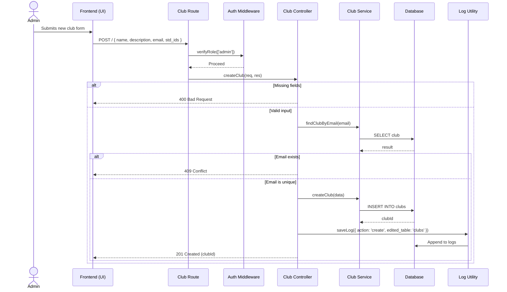
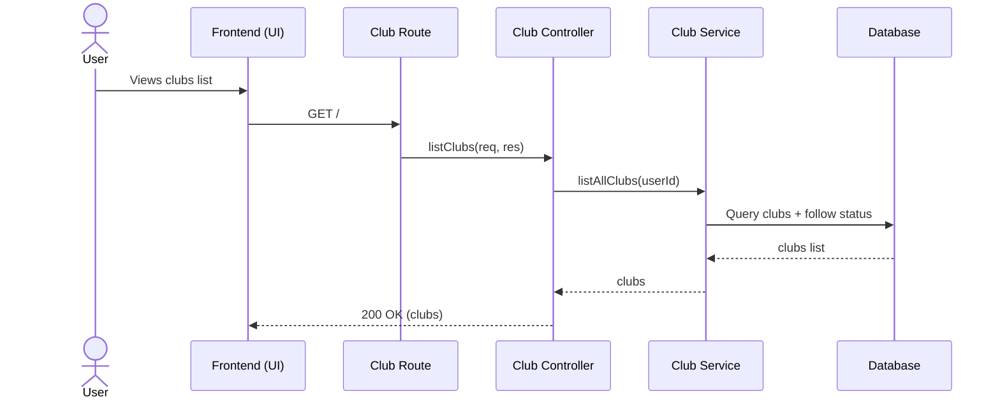
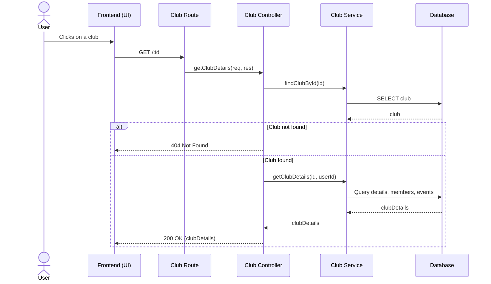
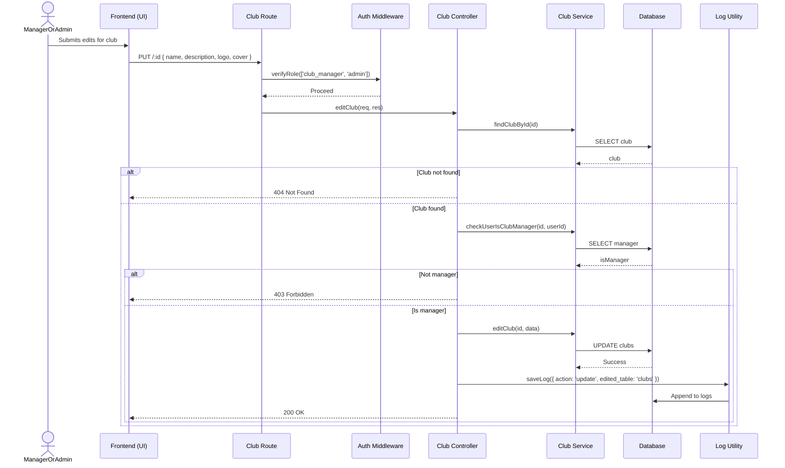
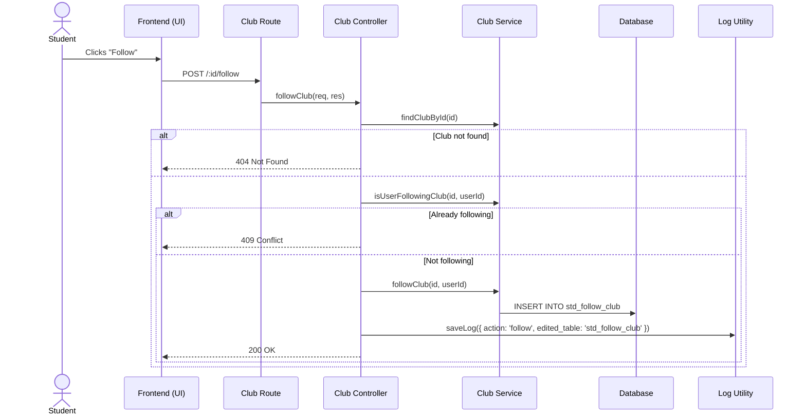
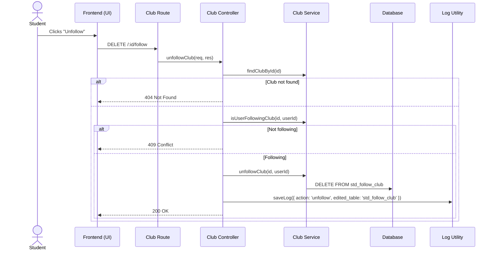
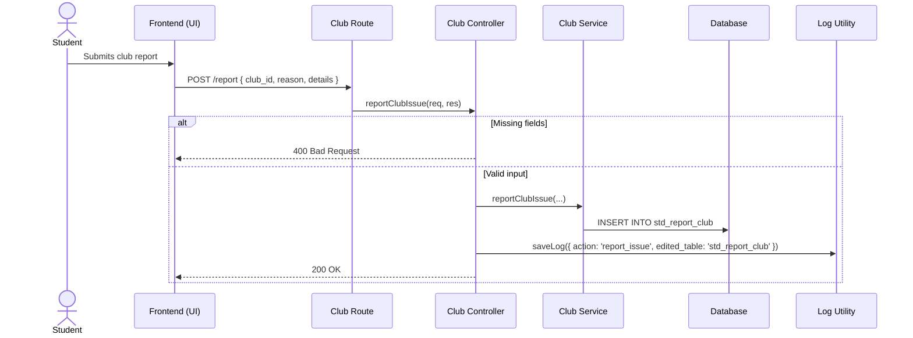

# Club Route Sequence Diagrams

## POST /

```mermaid
sequenceDiagram
    actor Admin
    participant UI as Frontend (UI)
    participant Route as Club Route
    participant AuthMW as Auth Middleware
    participant Ctrl as Club Controller
    participant Svc as Club Service
    participant DB as Database
    participant Log as Log Utility

    Admin->>UI: Submits new club form
    UI->>Route: POST / { name, description, email, std_ids }
    Route->>AuthMW: verifyRole(['admin'])
    AuthMW-->>Route: Proceed
    Route->>Ctrl: createClub(req, res)
    
    alt Missing fields
        Ctrl-->>UI: 400 Bad Request
    else Valid input
        Ctrl->>Svc: findClubByEmail(email)
        Svc->>DB: SELECT club
        DB-->>Svc: result
        
        alt Email exists
            Ctrl-->>UI: 409 Conflict
        else Email is unique
            Ctrl->>Svc: createClub(data)
            Svc->>DB: INSERT INTO clubs
            DB-->>Svc: clubId
            
            Ctrl->>Log: saveLog({ action: 'create', edited_table: 'clubs' })
            Log->>DB: Append to logs
            
            Ctrl-->>UI: 201 Created (clubId)
        end
    end
```

## GET /

```mermaid
sequenceDiagram
    actor User
    participant UI as Frontend (UI)
    participant Route as Club Route
    participant Ctrl as Club Controller
    participant Svc as Club Service
    participant DB as Database

    User->>UI: Views clubs list
    UI->>Route: GET /
    Route->>Ctrl: listClubs(req, res)
    Ctrl->>Svc: listAllClubs(userId)
    Svc->>DB: Query clubs + follow status
    DB-->>Svc: clubs list
    Svc-->>Ctrl: clubs
    Ctrl-->>UI: 200 OK (clubs)
```

## GET /:id

```mermaid
sequenceDiagram
    actor User
    participant UI as Frontend (UI)
    participant Route as Club Route
    participant Ctrl as Club Controller
    participant Svc as Club Service
    participant DB as Database

    User->>UI: Clicks on a club
    UI->>Route: GET /:id
    Route->>Ctrl: getClubDetails(req, res)
    Ctrl->>Svc: findClubById(id)
    Svc->>DB: SELECT club
    DB-->>Svc: club
    
    alt Club not found
        Ctrl-->>UI: 404 Not Found
    else Club found
        Ctrl->>Svc: getClubDetails(id, userId)
        Svc->>DB: Query details, members, events
        DB-->>Svc: clubDetails
        Svc-->>Ctrl: clubDetails
        Ctrl-->>UI: 200 OK (clubDetails)
    end
```

## PUT /:id

```mermaid
sequenceDiagram
    actor ManagerOrAdmin
    participant UI as Frontend (UI)
    participant Route as Club Route
    participant AuthMW as Auth Middleware
    participant Ctrl as Club Controller
    participant Svc as Club Service
    participant DB as Database
    participant Log as Log Utility

    ManagerOrAdmin->>UI: Submits edits for club
    UI->>Route: PUT /:id { name, description, logo, cover }
    Route->>AuthMW: verifyRole(['club_manager', 'admin'])
    AuthMW-->>Route: Proceed
    Route->>Ctrl: editClub(req, res)
    
    Ctrl->>Svc: findClubById(id)
    Svc->>DB: SELECT club
    DB-->>Svc: club
    
    alt Club not found
        Ctrl-->>UI: 404 Not Found
    else Club found
        Ctrl->>Svc: checkUserIsClubManager(id, userId)
        Svc->>DB: SELECT manager
        DB-->>Svc: isManager
        
        alt Not manager
            Ctrl-->>UI: 403 Forbidden
        else Is manager
            Ctrl->>Svc: editClub(id, data)
            Svc->>DB: UPDATE clubs
            DB-->>Svc: Success
            
            Ctrl->>Log: saveLog({ action: 'update', edited_table: 'clubs' })
            Log->>DB: Append to logs
            
            Ctrl-->>UI: 200 OK
        end
    end
```

## POST /:id/follow

```mermaid
sequenceDiagram
    actor Student
    participant UI as Frontend (UI)
    participant Route as Club Route
    participant Ctrl as Club Controller
    participant Svc as Club Service
    participant DB as Database
    participant Log as Log Utility

    Student->>UI: Clicks "Follow"
    UI->>Route: POST /:id/follow
    Route->>Ctrl: followClub(req, res)
    
    Ctrl->>Svc: findClubById(id)
    alt Club not found
        Ctrl-->>UI: 404 Not Found
    else
        Ctrl->>Svc: isUserFollowingClub(id, userId)
        alt Already following
            Ctrl-->>UI: 409 Conflict
        else Not following
            Ctrl->>Svc: followClub(id, userId)
            Svc->>DB: INSERT INTO std_follow_club
            
            Ctrl->>Log: saveLog({ action: 'follow', edited_table: 'std_follow_club' })
            Ctrl-->>UI: 200 OK
        end
    end
```

## DELETE /:id/follow

```mermaid
sequenceDiagram
    actor Student
    participant UI as Frontend (UI)
    participant Route as Club Route
    participant Ctrl as Club Controller
    participant Svc as Club Service
    participant DB as Database
    participant Log as Log Utility

    Student->>UI: Clicks "Unfollow"
    UI->>Route: DELETE /:id/follow
    Route->>Ctrl: unfollowClub(req, res)
    
    Ctrl->>Svc: findClubById(id)
    alt Club not found
        Ctrl-->>UI: 404 Not Found
    else
        Ctrl->>Svc: isUserFollowingClub(id, userId)
        alt Not following
            Ctrl-->>UI: 409 Conflict
        else Following
            Ctrl->>Svc: unfollowClub(id, userId)
            Svc->>DB: DELETE FROM std_follow_club
            
            Ctrl->>Log: saveLog({ action: 'unfollow', edited_table: 'std_follow_club' })
            Ctrl-->>UI: 200 OK
        end
    end
```

## POST /report

```mermaid
sequenceDiagram
    actor Student
    participant UI as Frontend (UI)
    participant Route as Club Route
    participant Ctrl as Club Controller
    participant Svc as Club Service
    participant DB as Database
    participant Log as Log Utility

    Student->>UI: Submits club report
    UI->>Route: POST /report { club_id, reason, details }
    Route->>Ctrl: reportClubIssue(req, res)
    
    alt Missing fields
        Ctrl-->>UI: 400 Bad Request
    else Valid input
        Ctrl->>Svc: reportClubIssue(...)
        Svc->>DB: INSERT INTO std_report_club
        
        Ctrl->>Log: saveLog({ action: 'report_issue', edited_table: 'std_report_club' })
        Ctrl-->>UI: 200 OK
    end
```