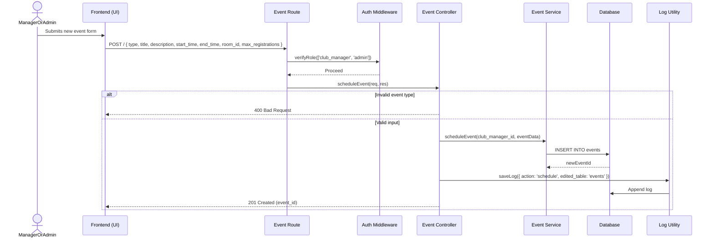
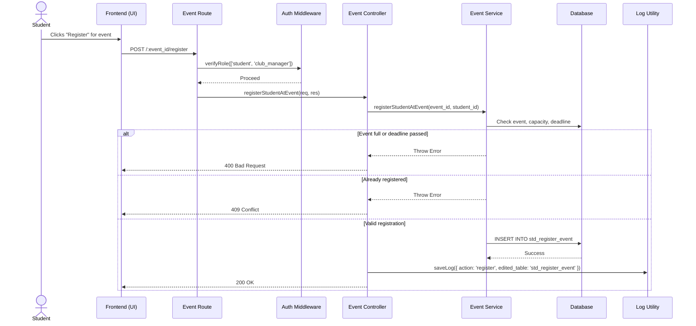
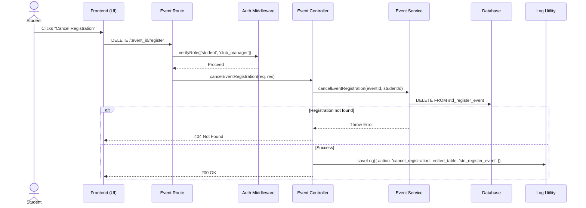
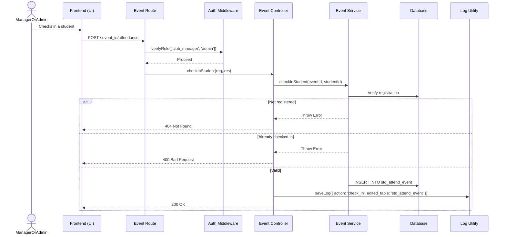
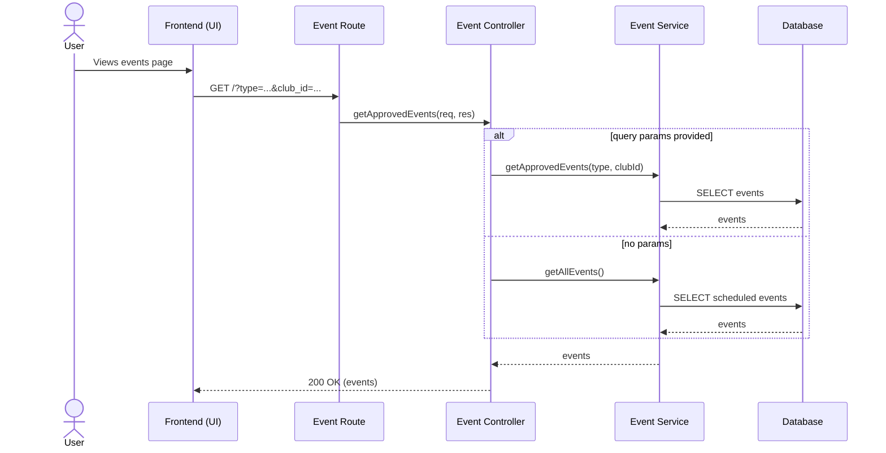
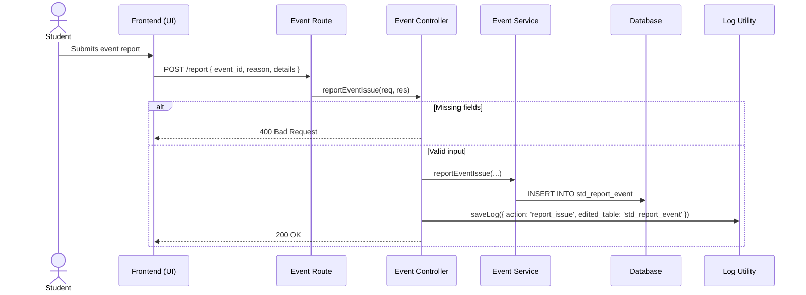

# Event Route Sequence Diagrams

## POST /

```mermaid
sequenceDiagram
    actor ManagerOrAdmin
    participant UI as Frontend (UI)
    participant Route as Event Route
    participant AuthMW as Auth Middleware
    participant Ctrl as Event Controller
    participant Svc as Event Service
    participant DB as Database
    participant Log as Log Utility

    ManagerOrAdmin->>UI: Submits new event form
    UI->>Route: POST / { type, title, description, start_time, end_time, room_id, max_registrations }
    Route->>AuthMW: verifyRole(['club_manager', 'admin'])
    AuthMW-->>Route: Proceed
    Route->>Ctrl: scheduleEvent(req, res)
    
    alt Invalid event type
        Ctrl-->>UI: 400 Bad Request
    else Valid input
        Ctrl->>Svc: scheduleEvent(club_manager_id, eventData)
        Svc->>DB: INSERT INTO events
        DB-->>Svc: newEventId
        
        Ctrl->>Log: saveLog({ action: 'schedule', edited_table: 'events' })
        Log->>DB: Append log
        
        Ctrl-->>UI: 201 Created (event_id)
    end
```

## POST /:event_id/register

```mermaid
sequenceDiagram
    actor Student
    participant UI as Frontend (UI)
    participant Route as Event Route
    participant AuthMW as Auth Middleware
    participant Ctrl as Event Controller
    participant Svc as Event Service
    participant DB as Database
    participant Log as Log Utility

    Student->>UI: Clicks "Register" for event
    UI->>Route: POST /:event_id/register
    Route->>AuthMW: verifyRole(['student', 'club_manager'])
    AuthMW-->>Route: Proceed
    Route->>Ctrl: registerStudentAtEvent(req, res)
    
    Ctrl->>Svc: registerStudentAtEvent(event_id, student_id)
    Svc->>DB: Check event, capacity, deadline
    
    alt Event full or deadline passed
        Svc-->>Ctrl: Throw Error
        Ctrl-->>UI: 400 Bad Request
    else Already registered
        Svc-->>Ctrl: Throw Error
        Ctrl-->>UI: 409 Conflict
    else Valid registration
        Svc->>DB: INSERT INTO std_register_event
        DB-->>Svc: Success
        
        Ctrl->>Log: saveLog({ action: 'register', edited_table: 'std_register_event' })
        
        Ctrl-->>UI: 200 OK
    end
```

## DELETE /:event_id/register

```mermaid
sequenceDiagram
    actor Student
    participant UI as Frontend (UI)
    participant Route as Event Route
    participant AuthMW as Auth Middleware
    participant Ctrl as Event Controller
    participant Svc as Event Service
    participant DB as Database
    participant Log as Log Utility

    Student->>UI: Clicks "Cancel Registration"
    UI->>Route: DELETE /:event_id/register
    Route->>AuthMW: verifyRole(['student', 'club_manager'])
    AuthMW-->>Route: Proceed
    Route->>Ctrl: cancelEventRegistration(req, res)
    
    Ctrl->>Svc: cancelEventRegistration(eventId, studentId)
    Svc->>DB: DELETE FROM std_register_event
    
    alt Registration not found
        Svc-->>Ctrl: Throw Error
        Ctrl-->>UI: 404 Not Found
    else Success
        Ctrl->>Log: saveLog({ action: 'cancel_registration', edited_table: 'std_register_event' })
        Ctrl-->>UI: 200 OK
    end
```

## POST /:event_id/attendance

```mermaid
sequenceDiagram
    actor ManagerOrAdmin
    participant UI as Frontend (UI)
    participant Route as Event Route
    participant AuthMW as Auth Middleware
    participant Ctrl as Event Controller
    participant Svc as Event Service
    participant DB as Database
    participant Log as Log Utility

    ManagerOrAdmin->>UI: Checks in a student
    UI->>Route: POST /:event_id/attendance
    Route->>AuthMW: verifyRole(['club_manager', 'admin'])
    AuthMW-->>Route: Proceed
    Route->>Ctrl: checkInStudent(req, res)
    
    Ctrl->>Svc: checkInStudent(eventId, studentId)
    Svc->>DB: Verify registration
    
    alt Not registered
        Svc-->>Ctrl: Throw Error
        Ctrl-->>UI: 404 Not Found
    else Already checked in
        Svc-->>Ctrl: Throw Error
        Ctrl-->>UI: 400 Bad Request
    else Valid
        Svc->>DB: INSERT INTO std_attend_event
        Ctrl->>Log: saveLog({ action: 'check_in', edited_table: 'std_attend_event' })
        Ctrl-->>UI: 200 OK
    end
```

## GET /

```mermaid
sequenceDiagram
    actor User
    participant UI as Frontend (UI)
    participant Route as Event Route
    participant Ctrl as Event Controller
    participant Svc as Event Service
    participant DB as Database

    User->>UI: Views events page
    UI->>Route: GET /?type=...&club_id=...
    Route->>Ctrl: getApprovedEvents(req, res)
    
    alt query params provided
        Ctrl->>Svc: getApprovedEvents(type, clubId)
        Svc->>DB: SELECT events
        DB-->>Svc: events
    else no params
        Ctrl->>Svc: getAllEvents()
        Svc->>DB: SELECT scheduled events
        DB-->>Svc: events
    end
    
    Svc-->>Ctrl: events
    Ctrl-->>UI: 200 OK (events)
```

## POST /report

```mermaid
sequenceDiagram
    actor Student
    participant UI as Frontend (UI)
    participant Route as Event Route
    participant Ctrl as Event Controller
    participant Svc as Event Service
    participant DB as Database
    participant Log as Log Utility

    Student->>UI: Submits event report
    UI->>Route: POST /report { event_id, reason, details }
    Route->>Ctrl: reportEventIssue(req, res)
    
    alt Missing fields
        Ctrl-->>UI: 400 Bad Request
    else Valid input
        Ctrl->>Svc: reportEventIssue(...)
        Svc->>DB: INSERT INTO std_report_event
        
        Ctrl->>Log: saveLog({ action: 'report_issue', edited_table: 'std_report_event' })
        Ctrl-->>UI: 200 OK
    end
```