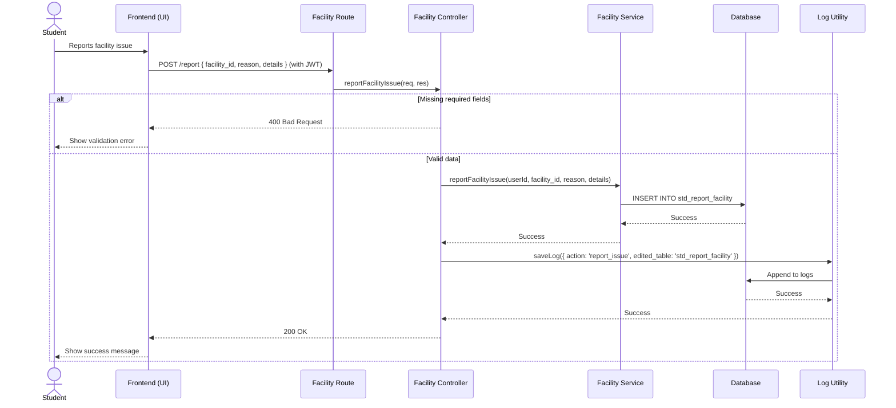

# Facility Route Sequence Diagrams

## POST /report

```mermaid
sequenceDiagram
    actor Student
    participant UI as Frontend (UI)
    participant Route as Facility Route
    participant Ctrl as Facility Controller
    participant Svc as Facility Service
    participant DB as Database
    participant Log as Log Utility

    Student->>UI: Reports facility issue
    UI->>Route: POST /report { facility_id, reason, details } (with JWT)
    Route->>Ctrl: reportFacilityIssue(req, res)
    
    alt Missing required fields
        Ctrl-->>UI: 400 Bad Request
        UI-->>Student: Show validation error
    else Valid data
        Ctrl->>Svc: reportFacilityIssue(userId, facility_id, reason, details)
        Svc->>DB: INSERT INTO std_report_facility
        DB-->>Svc: Success
        Svc-->>Ctrl: Success
        
        Ctrl->>Log: saveLog({ action: 'report_issue', edited_table: 'std_report_facility' })
        Log->>DB: Append to logs
        DB-->>Log: Success
        Log-->>Ctrl: Success
        
        Ctrl-->>UI: 200 OK
        UI-->>Student: Show success message
    end
```