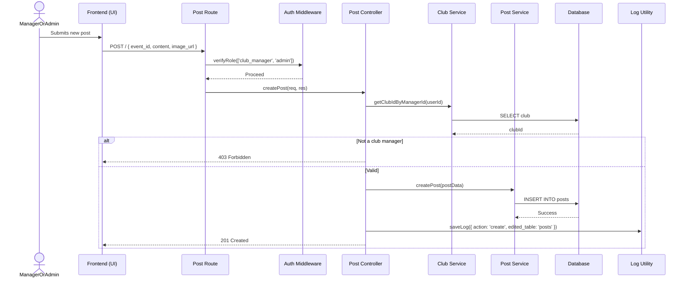
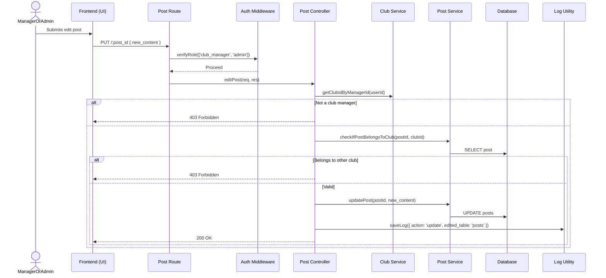
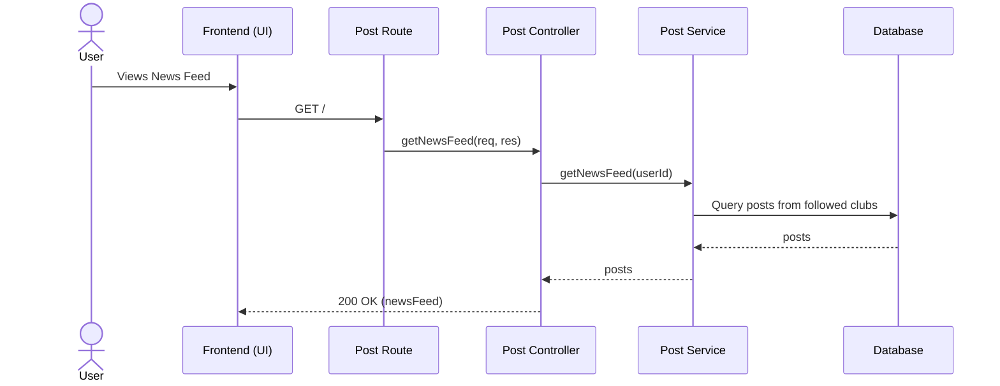
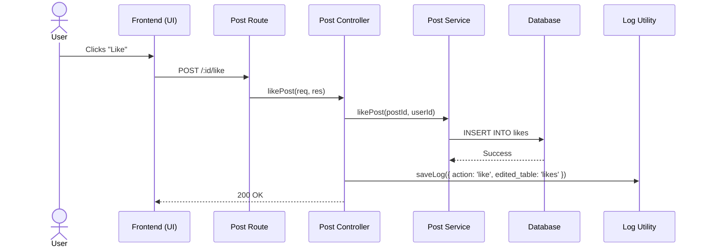
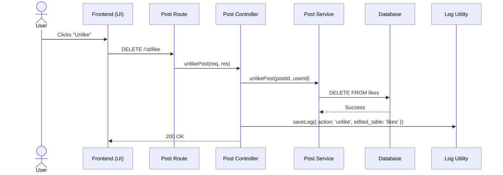
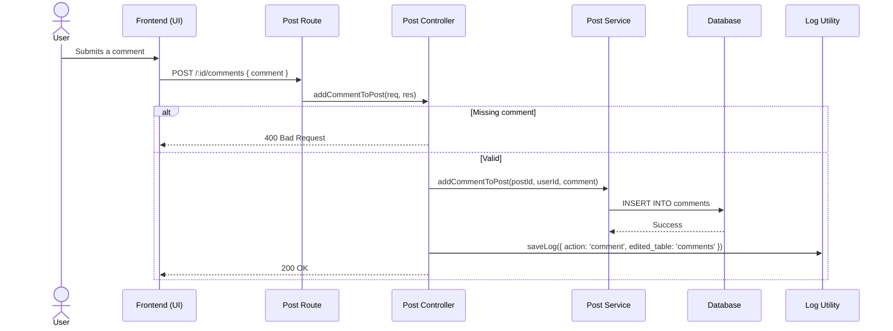

# Post Route Sequence Diagrams

## POST /

```mermaid
sequenceDiagram
    actor ManagerOrAdmin
    participant UI as Frontend (UI)
    participant Route as Post Route
    participant AuthMW as Auth Middleware
    participant Ctrl as Post Controller
    participant ClubSvc as Club Service
    participant Svc as Post Service
    participant DB as Database
    participant Log as Log Utility

    ManagerOrAdmin->>UI: Submits new post
    UI->>Route: POST / { event_id, content, image_url }
    Route->>AuthMW: verifyRole(['club_manager', 'admin'])
    AuthMW-->>Route: Proceed
    Route->>Ctrl: createPost(req, res)
    
    Ctrl->>ClubSvc: getClubIdByManagerId(userId)
    ClubSvc->>DB: SELECT club
    DB-->>ClubSvc: clubId
    
    alt Not a club manager
        Ctrl-->>UI: 403 Forbidden
    else Valid
        Ctrl->>Svc: createPost(postData)
        Svc->>DB: INSERT INTO posts
        DB-->>Svc: Success
        
        Ctrl->>Log: saveLog({ action: 'create', edited_table: 'posts' })
        Ctrl-->>UI: 201 Created
    end
```

## PUT /:post_id

```mermaid
sequenceDiagram
    actor ManagerOrAdmin
    participant UI as Frontend (UI)
    participant Route as Post Route
    participant AuthMW as Auth Middleware
    participant Ctrl as Post Controller
    participant ClubSvc as Club Service
    participant Svc as Post Service
    participant DB as Database
    participant Log as Log Utility

    ManagerOrAdmin->>UI: Submits edit post
    UI->>Route: PUT /:post_id { new_content }
    Route->>AuthMW: verifyRole(['club_manager', 'admin'])
    AuthMW-->>Route: Proceed
    Route->>Ctrl: editPost(req, res)
    
    Ctrl->>ClubSvc: getClubIdByManagerId(userId)
    
    alt Not a club manager
        Ctrl-->>UI: 403 Forbidden
    else
        Ctrl->>Svc: checkIfPostBelongsToClub(postId, clubId)
        Svc->>DB: SELECT post
        alt Belongs to other club
            Ctrl-->>UI: 403 Forbidden
        else Valid
            Ctrl->>Svc: updatePost(postId, new_content)
            Svc->>DB: UPDATE posts
            
            Ctrl->>Log: saveLog({ action: 'update', edited_table: 'posts' })
            Ctrl-->>UI: 200 OK
        end
    end
```

## GET /

```mermaid
sequenceDiagram
    actor User
    participant UI as Frontend (UI)
    participant Route as Post Route
    participant Ctrl as Post Controller
    participant Svc as Post Service
    participant DB as Database

    User->>UI: Views News Feed
    UI->>Route: GET /
    Route->>Ctrl: getNewsFeed(req, res)
    Ctrl->>Svc: getNewsFeed(userId)
    Svc->>DB: Query posts from followed clubs
    DB-->>Svc: posts
    Svc-->>Ctrl: posts
    Ctrl-->>UI: 200 OK (newsFeed)
```

## POST /:id/like

```mermaid
sequenceDiagram
    actor User
    participant UI as Frontend (UI)
    participant Route as Post Route
    participant Ctrl as Post Controller
    participant Svc as Post Service
    participant DB as Database
    participant Log as Log Utility

    User->>UI: Clicks "Like"
    UI->>Route: POST /:id/like
    Route->>Ctrl: likePost(req, res)
    Ctrl->>Svc: likePost(postId, userId)
    Svc->>DB: INSERT INTO likes
    DB-->>Svc: Success
    
    Ctrl->>Log: saveLog({ action: 'like', edited_table: 'likes' })
    Ctrl-->>UI: 200 OK
```

## DELETE /:id/like

```mermaid
sequenceDiagram
    actor User
    participant UI as Frontend (UI)
    participant Route as Post Route
    participant Ctrl as Post Controller
    participant Svc as Post Service
    participant DB as Database
    participant Log as Log Utility

    User->>UI: Clicks "Unlike"
    UI->>Route: DELETE /:id/like
    Route->>Ctrl: unlikePost(req, res)
    Ctrl->>Svc: unlikePost(postId, userId)
    Svc->>DB: DELETE FROM likes
    DB-->>Svc: Success
    
    Ctrl->>Log: saveLog({ action: 'unlike', edited_table: 'likes' })
    Ctrl-->>UI: 200 OK
```

## POST /:id/comments

```mermaid
sequenceDiagram
    actor User
    participant UI as Frontend (UI)
    participant Route as Post Route
    participant Ctrl as Post Controller
    participant Svc as Post Service
    participant DB as Database
    participant Log as Log Utility

    User->>UI: Submits a comment
    UI->>Route: POST /:id/comments { comment }
    Route->>Ctrl: addCommentToPost(req, res)
    
    alt Missing comment
        Ctrl-->>UI: 400 Bad Request
    else Valid
        Ctrl->>Svc: addCommentToPost(postId, userId, comment)
        Svc->>DB: INSERT INTO comments
        DB-->>Svc: Success
        
        Ctrl->>Log: saveLog({ action: 'comment', edited_table: 'comments' })
        Ctrl-->>UI: 200 OK
    end
```