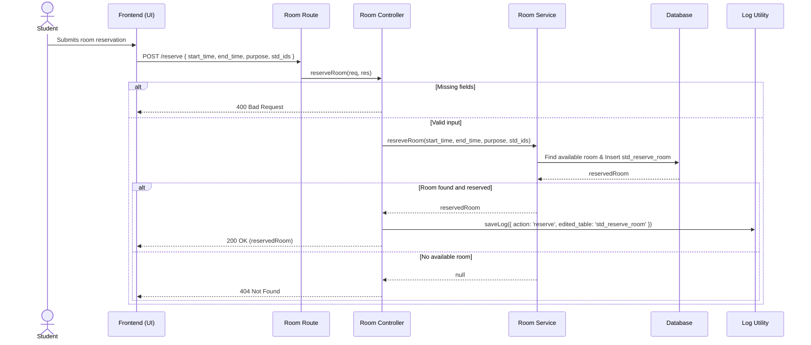
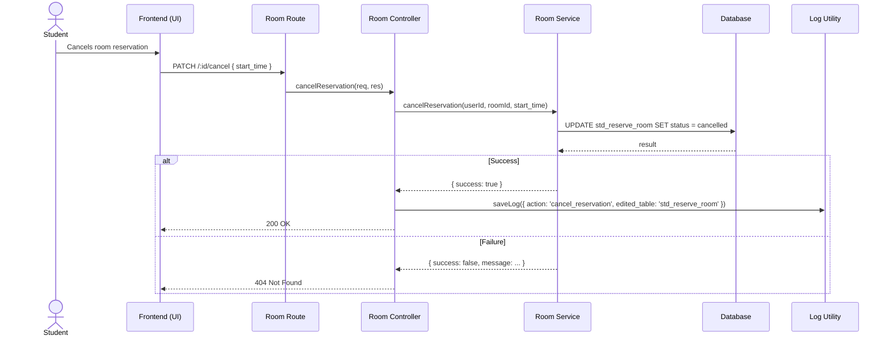
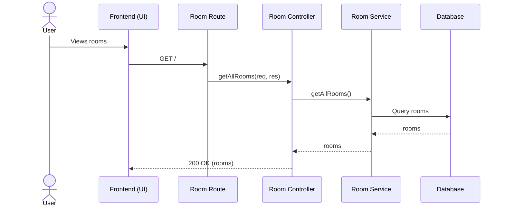
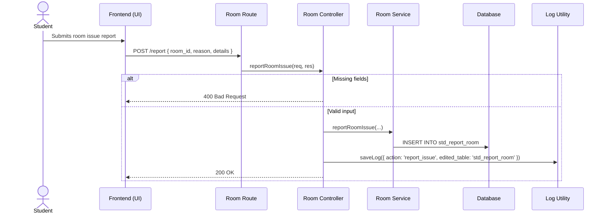
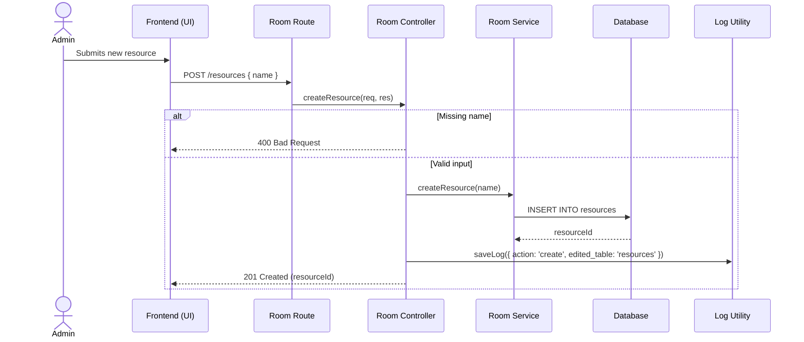
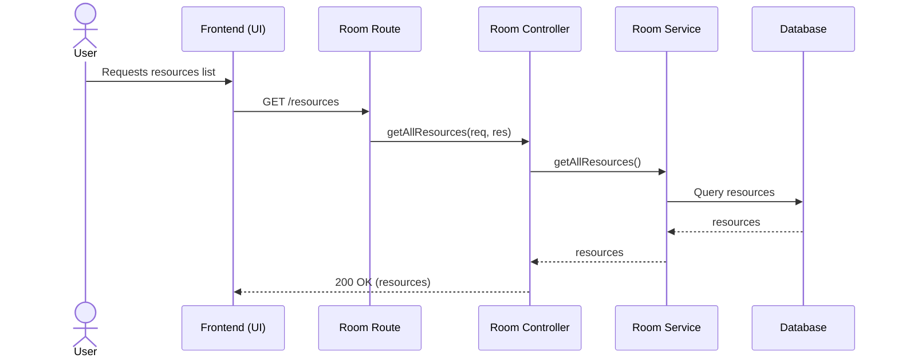

# Room Route Sequence Diagrams

## POST /reserve

```mermaid
sequenceDiagram
    actor Student
    participant UI as Frontend (UI)
    participant Route as Room Route
    participant Ctrl as Room Controller
    participant Svc as Room Service
    participant DB as Database
    participant Log as Log Utility

    Student->>UI: Submits room reservation
    UI->>Route: POST /reserve { start_time, end_time, purpose, std_ids }
    Route->>Ctrl: reserveRoom(req, res)
    
    alt Missing fields
        Ctrl-->>UI: 400 Bad Request
    else Valid input
        Ctrl->>Svc: resreveRoom(start_time, end_time, purpose, std_ids)
        Svc->>DB: Find available room & Insert std_reserve_room
        DB-->>Svc: reservedRoom
        
        alt Room found and reserved
            Svc-->>Ctrl: reservedRoom
            Ctrl->>Log: saveLog({ action: 'reserve', edited_table: 'std_reserve_room' })
            Ctrl-->>UI: 200 OK (reservedRoom)
        else No available room
            Svc-->>Ctrl: null
            Ctrl-->>UI: 404 Not Found
        end
    end
```

## PATCH /:id/cancel

```mermaid
sequenceDiagram
    actor Student
    participant UI as Frontend (UI)
    participant Route as Room Route
    participant Ctrl as Room Controller
    participant Svc as Room Service
    participant DB as Database
    participant Log as Log Utility

    Student->>UI: Cancels room reservation
    UI->>Route: PATCH /:id/cancel { start_time }
    Route->>Ctrl: cancelReservation(req, res)
    
    Ctrl->>Svc: cancelReservation(userId, roomId, start_time)
    Svc->>DB: UPDATE std_reserve_room SET status = cancelled
    DB-->>Svc: result
    
    alt Success
        Svc-->>Ctrl: { success: true }
        Ctrl->>Log: saveLog({ action: 'cancel_reservation', edited_table: 'std_reserve_room' })
        Ctrl-->>UI: 200 OK
    else Failure
        Svc-->>Ctrl: { success: false, message: ... }
        Ctrl-->>UI: 404 Not Found
    end
```

## GET /

```mermaid
sequenceDiagram
    actor User
    participant UI as Frontend (UI)
    participant Route as Room Route
    participant Ctrl as Room Controller
    participant Svc as Room Service
    participant DB as Database

    User->>UI: Views rooms
    UI->>Route: GET /
    Route->>Ctrl: getAllRooms(req, res)
    Ctrl->>Svc: getAllRooms()
    Svc->>DB: Query rooms
    DB-->>Svc: rooms
    Svc-->>Ctrl: rooms
    Ctrl-->>UI: 200 OK (rooms)
```

## POST /report

```mermaid
sequenceDiagram
    actor Student
    participant UI as Frontend (UI)
    participant Route as Room Route
    participant Ctrl as Room Controller
    participant Svc as Room Service
    participant DB as Database
    participant Log as Log Utility

    Student->>UI: Submits room issue report
    UI->>Route: POST /report { room_id, reason, details }
    Route->>Ctrl: reportRoomIssue(req, res)
    
    alt Missing fields
        Ctrl-->>UI: 400 Bad Request
    else Valid input
        Ctrl->>Svc: reportRoomIssue(...)
        Svc->>DB: INSERT INTO std_report_room
        
        Ctrl->>Log: saveLog({ action: 'report_issue', edited_table: 'std_report_room' })
        Ctrl-->>UI: 200 OK
    end
```

## POST /resources

```mermaid
sequenceDiagram
    actor Admin
    participant UI as Frontend (UI)
    participant Route as Room Route
    participant Ctrl as Room Controller
    participant Svc as Room Service
    participant DB as Database
    participant Log as Log Utility

    Admin->>UI: Submits new resource
    UI->>Route: POST /resources { name }
    Route->>Ctrl: createResource(req, res)
    
    alt Missing name
        Ctrl-->>UI: 400 Bad Request
    else Valid input
        Ctrl->>Svc: createResource(name)
        Svc->>DB: INSERT INTO resources
        DB-->>Svc: resourceId
        
        Ctrl->>Log: saveLog({ action: 'create', edited_table: 'resources' })
        Ctrl-->>UI: 201 Created (resourceId)
    end
```

## GET /resources

```mermaid
sequenceDiagram
    actor User
    participant UI as Frontend (UI)
    participant Route as Room Route
    participant Ctrl as Room Controller
    participant Svc as Room Service
    participant DB as Database

    User->>UI: Requests resources list
    UI->>Route: GET /resources
    Route->>Ctrl: getAllResources(req, res)
    Ctrl->>Svc: getAllResources()
    Svc->>DB: Query resources
    DB-->>Svc: resources
    Svc-->>Ctrl: resources
    Ctrl-->>UI: 200 OK (resources)
```