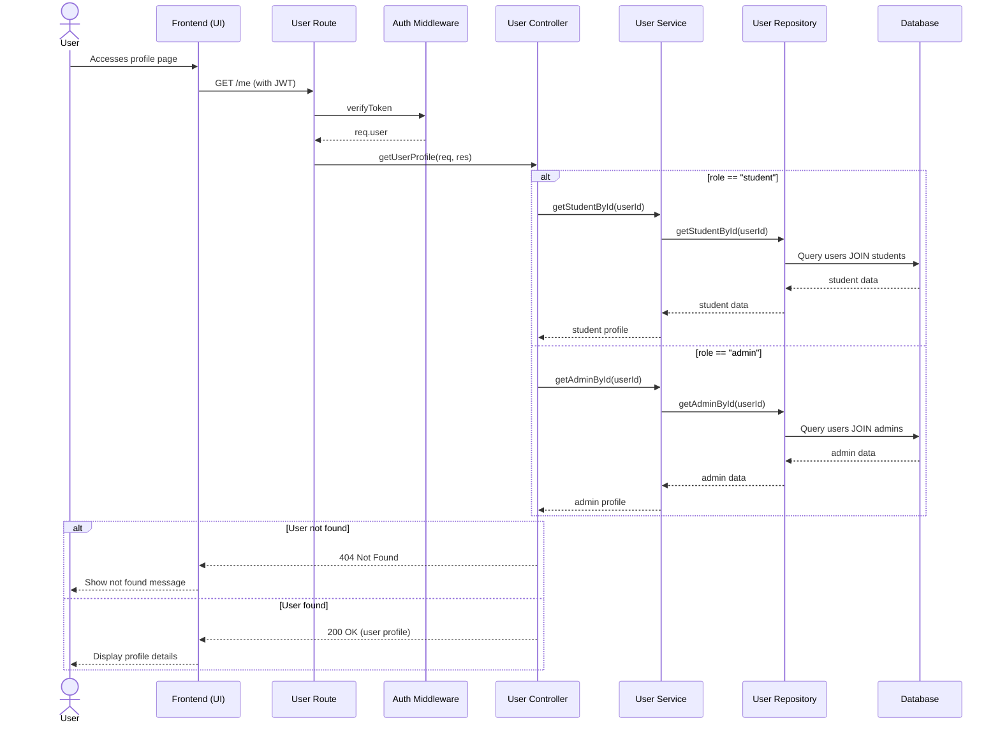
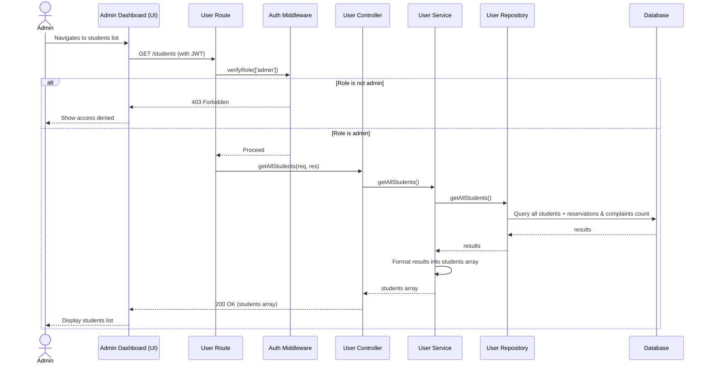
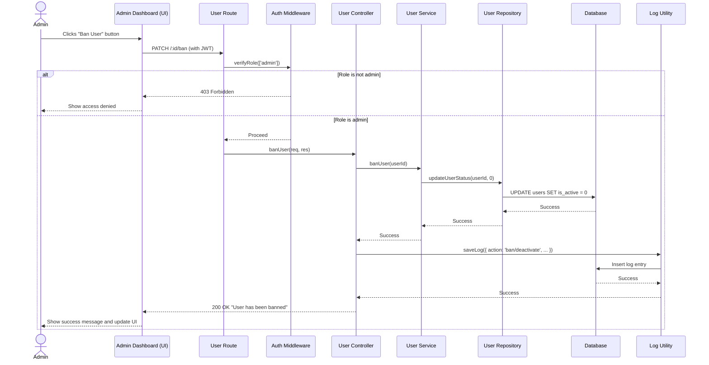
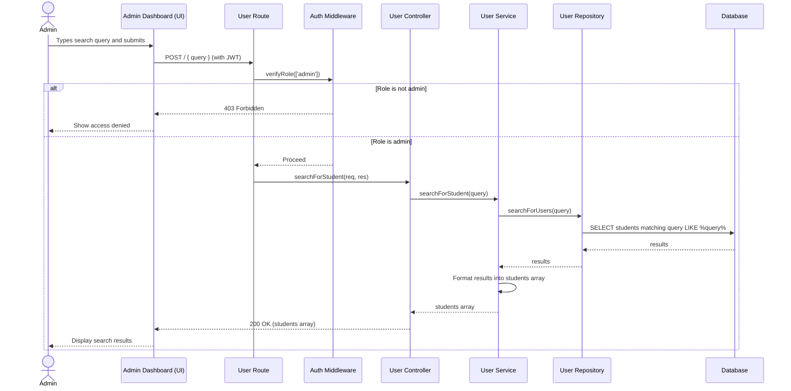

# User Route Sequence Diagrams

## GET /me

```mermaid
sequenceDiagram
    actor User
    participant UI as Frontend (UI)
    participant Route as User Route
    participant AuthMW as Auth Middleware
    participant Ctrl as User Controller
    participant Svc as User Service
    participant Repo as User Repository
    participant DB as Database

    User->>UI: Accesses profile page
    UI->>Route: GET /me (with JWT)
    Route->>AuthMW: verifyToken
    AuthMW-->>Route: req.user
    Route->>Ctrl: getUserProfile(req, res)
    
    alt role == "student"
        Ctrl->>Svc: getStudentById(userId)
        Svc->>Repo: getStudentById(userId)
        Repo->>DB: Query users JOIN students
        DB-->>Repo: student data
        Repo-->>Svc: student data
        Svc-->>Ctrl: student profile
    else role == "admin"
        Ctrl->>Svc: getAdminById(userId)
        Svc->>Repo: getAdminById(userId)
        Repo->>DB: Query users JOIN admins
        DB-->>Repo: admin data
        Repo-->>Svc: admin data
        Svc-->>Ctrl: admin profile
    end

    alt User not found
        Ctrl-->>UI: 404 Not Found
        UI-->>User: Show not found message
    else User found
        Ctrl-->>UI: 200 OK (user profile)
        UI-->>User: Display profile details
    end
```

## GET /students

```mermaid
sequenceDiagram
    actor Admin
    participant UI as Admin Dashboard (UI)
    participant Route as User Route
    participant AuthMW as Auth Middleware
    participant Ctrl as User Controller
    participant Svc as User Service
    participant Repo as User Repository
    participant DB as Database

    Admin->>UI: Navigates to students list
    UI->>Route: GET /students (with JWT)
    Route->>AuthMW: verifyRole(['admin'])
    
    alt Role is not admin
        AuthMW-->>UI: 403 Forbidden
        UI-->>Admin: Show access denied
    else Role is admin
        AuthMW-->>Route: Proceed
        Route->>Ctrl: getAllStudents(req, res)
        Ctrl->>Svc: getAllStudents()
        Svc->>Repo: getAllStudents()
        Repo->>DB: Query all students + reservations & complaints count
        DB-->>Repo: results
        Repo-->>Svc: results
        Svc->>Svc: Format results into students array
        Svc-->>Ctrl: students array
        Ctrl-->>UI: 200 OK (students array)
        UI-->>Admin: Display students list
    end
```

## PATCH /:id/ban

```mermaid
sequenceDiagram
    actor Admin
    participant UI as Admin Dashboard (UI)
    participant Route as User Route
    participant AuthMW as Auth Middleware
    participant Ctrl as User Controller
    participant Svc as User Service
    participant Repo as User Repository
    participant DB as Database
    participant Log as Log Utility

    Admin->>UI: Clicks "Ban User" button
    UI->>Route: PATCH /:id/ban (with JWT)
    Route->>AuthMW: verifyRole(['admin'])
    
    alt Role is not admin
        AuthMW-->>UI: 403 Forbidden
        UI-->>Admin: Show access denied
    else Role is admin
        AuthMW-->>Route: Proceed
        Route->>Ctrl: banUser(req, res)
        Ctrl->>Svc: banUser(userId)
        Svc->>Repo: updateUserStatus(userId, 0)
        Repo->>DB: UPDATE users SET is_active = 0
        DB-->>Repo: Success
        Repo-->>Svc: Success
        Svc-->>Ctrl: Success
        
        Ctrl->>Log: saveLog({ action: 'ban/deactivate', ... })
        Log->>DB: Insert log entry
        DB-->>Log: Success
        Log-->>Ctrl: Success
        
        Ctrl-->>UI: 200 OK "User has been banned"
        UI-->>Admin: Show success message and update UI
    end
```

## POST / (Search for Student)

```mermaid
sequenceDiagram
    actor Admin
    participant UI as Admin Dashboard (UI)
    participant Route as User Route
    participant AuthMW as Auth Middleware
    participant Ctrl as User Controller
    participant Svc as User Service
    participant Repo as User Repository
    participant DB as Database

    Admin->>UI: Types search query and submits
    UI->>Route: POST / { query } (with JWT)
    Route->>AuthMW: verifyRole(['admin'])
    
    alt Role is not admin
        AuthMW-->>UI: 403 Forbidden
        UI-->>Admin: Show access denied
    else Role is admin
        AuthMW-->>Route: Proceed
        Route->>Ctrl: searchForStudent(req, res)
        Ctrl->>Svc: searchForStudent(query)
        Svc->>Repo: searchForUsers(query)
        Repo->>DB: SELECT students matching query LIKE %query%
        DB-->>Repo: results
        Repo-->>Svc: results
        Svc->>Svc: Format results into students array
        Svc-->>Ctrl: students array
        Ctrl-->>UI: 200 OK (students array)
        UI-->>Admin: Display search results
    end
```